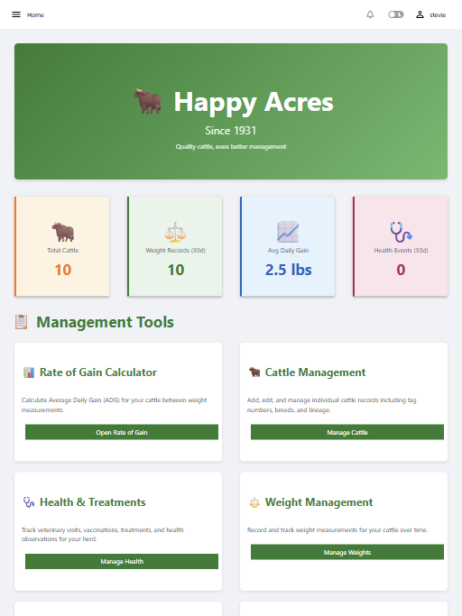
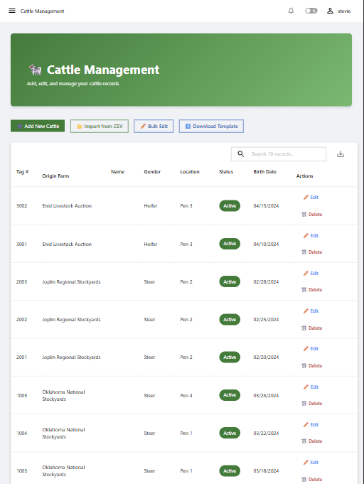
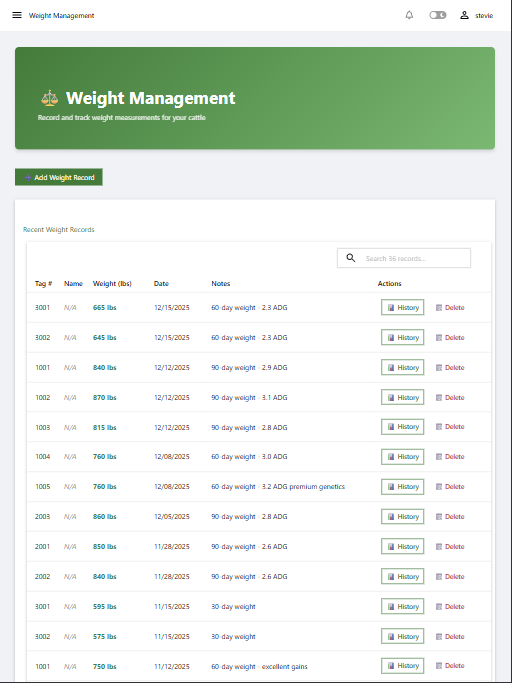
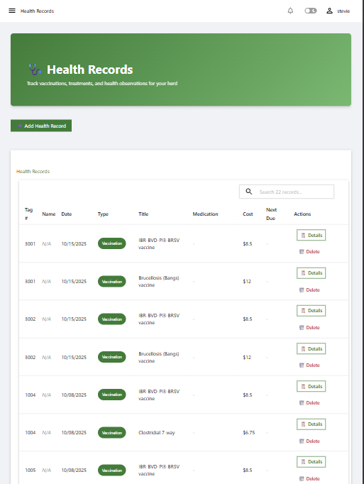

# 🐄 PowerShell Universal Herd Management App

A comprehensive cattle management application built with PowerShell Universal, designed to streamline livestock tracking, weight monitoring, health records, and performance analytics for cattle operations.

<a id="overview"></a>
## 📋 Overview

Herd Manager is a web-based application that provides ranchers and livestock managers with powerful tools to track and analyze their cattle herd. Built on PowerShell Universal Dashboard, it offers an intuitive interface for managing all aspects of cattle operations from a single platform.

## 📚 Table of Contents

- [Overview](#overview)
- [Key Features](#key-features)
   - [Cattle Management](#cattle-management)
   - [Farm Management](#farm-management)
   - [Weight Management](#weight-management)
   - [Rate of Gain Analysis](#rate-of-gain-analysis)
   - [Health Records](#health-records)
   - [Feed Records](#feed-records)
   - [Reporting & Analytics](#reporting--analytics)
   - [Notifications Dashboard](#notifications-dashboard)
   - [Accounting & Invoicing](#accounting--invoicing)
- [Technical Stack](#technical-stack)
- [Screenshots](#screenshots)
- [Project Structure](#project-structure)
- [Database Schema](#database-schema)
- [Installation](#installation)
   - [Prerequisites](#prerequisites)
   - [Setup Steps](#setup-steps)
- [Features in Detail](#features-in-detail)
   - [Smart Date Handling](#smart-date-handling)
   - [Location Management](#location-management)
   - [Print Functionality](#print-functionality)
   - [Responsive UI](#responsive-ui)
- [Development](#development)
- [Testing](#testing)
- [Troubleshooting](#troubleshooting)
- [Contributing](#contributing)
- [Support](#support)

<a id="key-features"></a>

## ✨ Key Features

<a id="cattle-management"></a>

### 🐮 Cattle Management

- **Comprehensive Animal Profiles**: Track individual animals with tag numbers, names, breed, gender, birth dates, origin farm, and current location
- **Farm Integration**: Link cattle to farm records for origin and ownership tracking
- **Location Tracking**: Manage cattle across 6 pens, quarantine area, and pasture
- **Status Tracking**: Monitor animal status (Active, Sold, Deceased, Transferred)
- **CSV Import**: Bulk import cattle records from CSV files
- **Searchable Database**: Quick search and filter capabilities across all cattle records
- **Dynamic Dropdowns**: Smart form fields that adapt based on available farm data

<a id="farm-management"></a>

### 🏡 Farm Management

- **Farm Registry**: Maintain complete farm/ranch contact information
- **Origin Tracking**: Mark farms as cattle origins for specialized filtering
- **Contact Management**: Store addresses, phone numbers, emails, and contact persons
- **Owner Tracking**: All farms available for cattle ownership assignment
- **Smart Dropdowns**: Origin Farm dropdown shows only origin farms; Owner dropdown shows all farms
- **Active/Inactive Status**: Manage farm lifecycle without data loss
- **Edit Capabilities**: Update farm information including origin status anytime

<a id="weight-management"></a>

### ⚖️ Weight Management

- **Weight Recording**: Log weight measurements with dates and measurement methods
- **Weight History**: View complete weight history for each animal with trend visualization
- **Automatic Calculations**: Track weight gain over time
- **Multiple Units**: Support for pounds (lbs) and kilograms (kg)

<a id="rate-of-gain-analysis"></a>

### 📈 Rate of Gain Analysis

- **Average Daily Gain (ADG)**: Calculate and track ADG between any two weight measurements
- **Historical Tracking**: View complete ROG calculation history for performance analysis
- **Period Comparisons**: Compare performance across different time periods
- **Automated Calculations**: Compute total gain, days between measurements, and daily averages

<a id="health-records"></a>

### 🏥 Health Records

- **Medical History**: Track vaccinations, treatments, veterinary visits, and observations
- **Medication Tracking**: Record medications, dosages, and administration dates
- **Cost Tracking**: Monitor veterinary and treatment expenses
- **Due Date Reminders**: Track next vaccination or treatment due dates
- **Overdue Alerts**: Automatic notifications for overdue health events

<a id="feed-records"></a>

### 🍽️ Feed Records

- **Daily Feed Tracking**: Record daily feed mix quantities (haylage, silage, high moisture corn)
- **Feed History**: View complete feeding history with searchable records
- **Total Calculations**: Automatic calculation of total feed pounds per day
- **Notes Support**: Add contextual notes for each feeding record

<a id="reporting--analytics"></a>

### 📊 Reporting & Analytics

- **Individual Animal Reports**: Comprehensive per-animal reports with complete history
- **Performance Summaries**: Current weight, starting weight, total gain, and average ADG
- **Print-Friendly Reports**: Generate printable reports for record-keeping
- **Data Visualization**: Charts and graphs for weight trends and performance metrics

<a id="notifications-dashboard"></a>

### 🔔 Notifications Dashboard

- **Centralized Alerts**: View all important notifications in one place
- **Overdue Health Events**: Immediate visibility of past-due vaccinations and treatments
- **Weight Check Reminders**: Alerts for cattle needing weight measurements
- **Upcoming Events**: Color-coded display of events by urgency (red: ≤7 days, orange: ≤14 days, blue: >14 days)

<a id="accounting--invoicing"></a>

### 💰 Accounting & Invoicing

- **Multi-Cattle Invoicing**: Create invoices for single or multiple cattle on one invoice
- **Invoice Generation**: Create professional invoices with automatic cost calculations
- **Cost Tracking**: Combine feeding costs (days × daily rate) and health costs (veterinary expenses)
- **Line Item Detail**: Each animal on multi-cattle invoices shows individual costs and subtotals
- **Invoice Management**: Search, view, and print invoices in a clean, professional format
- **Payment Terms**: NET 30 payment terms with automatic due date calculation
- **Print-Ready Invoices**: Professional invoice layout with company branding and contact information
- **Cost Breakdown**: Detailed itemization of feeding costs and health/veterinary expenses per animal
- **Owner Billing**: Associate cattle with farm owners for accurate billing

<a id="technical-stack"></a>

## 🛠️ Technical Stack

- **Platform**: PowerShell Universal Dashboard v5
- **Database**: SQLite with optimized schema and indexes
- **Language**: PowerShell 7
- **UI Framework**: Material-UI components via Universal Dashboard
- **Data Access**: PSSQLite module for database operations

<a id="screenshots"></a>

## 📷 Screenshots

Below are some screenshots of the application

- Homepage



- Cattle Management



- Weight Management



* Health Records



More screenshots available in the [screenshots](/src/PowerShellUniversal.Apps.HerdManager/docs/screenshots/) folder.

<a id="project-structure"></a>

## 📁 Project Structure

```text
PowerShellUniversal.Apps.HerdManager/
├── src/
│   └── PowerShellUniversal.Apps.HerdManager/
│       ├── dashboards/
│       │   └── HerdManager/
│       │       ├── HerdManager.ps1              # Main dashboard configuration
│       │       └── pages/
│       │           ├── Homepage.ps1             # Dashboard home page
│       │           ├── Notifications.ps1        # Alerts and reminders
│       │           ├── CattleManagement.ps1     # Cattle CRUD operations
│       │           ├── WeightManagement.ps1     # Weight recording and history
│       │           ├── HealthRecords.ps1        # Health tracking
│       │           ├── FeedRecords.ps1          # Daily feed tracking
│       │           ├── Farms.ps1                # Farm management
│       │           ├── RateOfGain.ps1           # ROG calculations
│       │           ├── AnimalReport.ps1         # Individual animal reports
│       │           ├── Accounting.ps1           # Invoice management
│       │           ├── Invoice.ps1              # Invoice display page
│       │           └── Reports.ps1              # Herd-wide analytics
│       ├── functions/
│       │   └── public/
│       │       ├── Add-CattleRecord.ps1
│       │       ├── Add-WeightRecord.ps1
│       │       ├── Add-Invoice.ps1
│       │       ├── Add-Farm.ps1
│       │       ├── Get-Farm.ps1
│       │       ├── Update-Farm.ps1
│       │       ├── Measure-RateOfGain.ps1
│       │       ├── Get-AllCattle.ps1
│       │       ├── Get-CattleById.ps1
│       │       ├── Get-Invoice.ps1
│       │       ├── Get-RateOfGainHistory.ps1
│       │       ├── Get-WeightHistory.ps1
│       │       ├── Initialize-HerdDatabase.ps1
│       │       ├── New-UDHerdManagerApp.ps1
│       │       └── Update-CattleRecord.ps1
│       ├── data/
│       │   ├── Database-Schema.sql              # Complete database schema
│       │   └── HerdManager.db                   # SQLite database
│       ├── PowerShellUniversal.Apps.HerdManager.psm1
│       ├── PowerShellUniversal.Apps.HerdManager.psd1
│       └── .universal/
│           └── dashboards.ps1                   # PSU dashboard registration
└── tests/                                       # Test files (if applicable)
```

<a id="database-schema"></a>

## 🗄️ Database Schema

### Core Tables

- **Cattle**: Animal profiles with demographics, location, status, owner, and daily feeding rate
- **WeightRecords**: Complete weight measurement history
- **RateOfGainCalculations**: Computed performance metrics
- **HealthRecords**: Medical history, treatments, and associated costs
- **FeedRecords**: Daily feed mix recordings
- **Invoices**: Invoice tracking with feeding costs, health costs, and payment terms

### Views

- **CattleWithLatestWeight**: Quick access to current animal weights
- **RecentRateOfGain**: Latest performance calculations

### Indexes

Optimized indexes on frequently queried fields for fast performance

<a id="installation"></a>

## 🚀 Installation

<a id="prerequisites"></a>

### Prerequisites

- PowerShell 7 or later
- PowerShell Universal (licensed or trial)
- PSSQLite PowerShell module

<a id="setup-steps"></a>

### Setup Steps

1. **Clone the Repository**

   ```powershell
   git clone https://github.com/steviecoaster/PowerShellUniversal.Apps.HerdMgr.git
   cd PowerShellUniversal.Apps.HerdMgr
   ```

2. **Import the Module**

   ```powershell
   Import-Module .\src\PowerShellUniversal.Apps.HerdManager\PowerShellUniversal.Apps.HerdManager.psd1
   ```

3. **Initialize Database** (if starting fresh)

   ```powershell
   Initialize-HerdDatabase
   ```

4. **Register with PowerShell Universal**

   - Copy the module to your PSU modules directory, or
   - Use the `.universal\dashboards.ps1` configuration
   - Restart PowerShell Universal service

5. **Access the Dashboard**

   - Navigate to: `http://localhost:5000/herdmanager` (or your PSU URL)

   In-app Help

   - The full Usage Guide is available inside the application under the **Help** menu (Help → Usage Guide) once the module is installed/reloaded.

<a id="features-in-detail"></a>

## 🎨 Features in Detail

<a id="smart-date-handling"></a>

### Smart Date Handling

- Automatic date format conversion (MM/dd/yyyy HH:mm:ss)
- CAST AS TEXT in SQL queries prevents parsing errors
- Consistent date storage across all tables

<a id="location-management"></a>

### Location Management

- 8 location options: Pen 1-6, Quarantine, Pasture
- Track animal movements over time
- Filter and sort by location
- Quick location updates via edit modal

<a id="print-functionality"></a>

### Print Functionality

- CSS `@media print` rules for clean printouts
- Hides navigation and buttons
- Optimized layout for paper
- Professional-looking reports

<a id="responsive-ui"></a>

### Responsive UI

- Material-UI design system
- Color-coded status indicators
- Sortable and searchable tables
- Modal dialogs for forms
- Toast notifications for feedback

### Data Validation

- Required field enforcement
- Type validation (dates, numbers, enums)
- Unique constraints (tag numbers, feed dates)
- SQL parameter binding prevents injection

### Accounting & Billing Workflow

1. **Setup**: Add Owner and PricePerDay to cattle records
2. **Track Costs**: Record health events with associated costs in HealthRecords
3. **Generate Invoice**: 
   - Select animal from dropdown
   - Set start and end dates (defaults to purchase date and current date)
   - System automatically calculates:
     - Days on feed
     - Feeding costs (Days × Price per day)
     - Health costs (Sum of all health record costs)
     - Total cost
4. **Search Invoices**: Find invoices by invoice number
5. **View/Print**: Open invoices in new tab with professional print-ready layout
6. **Payment Terms**: NET 30 with automatic due date calculation

## 🔧 Configuration

### Database Path

Configured in module: `$script:DatabasePath = Join-Path $PSScriptRoot 'data\HerdManager.db'`

### PowerShell Universal Settings

Edit `.universal\dashboards.ps1`:

```powershell
$app = @{
    Name        = "Herd Manager"
    BaseUrl     = '/herdmanager'
    Module      = 'PowerShellUniversal.Apps.HerdManager'
    Command     = 'New-UDHerdManagerApp'
    AutoDeploy  = $true
    Environment = 'PowerShell 7'
}
```

## 🧪 Development

<a id="development"></a>

### Adding New Features

1. Create function in `functions\public\` or `functions\private\`
2. Export public functions in `.psd1` manifest
3. Add page in `dashboards\HerdManager\pages\`
4. Register page in `HerdManager.ps1` pages array
5. Add navigation menu item if needed

### Database Changes

1. Update `data\Database-Schema.sql`
2. Run ALTER TABLE commands on existing database
3. Update affected views and functions
4. Test data migration on sample data

Migrations included

- `src\PowerShellUniversal.Apps.HerdManager\data\Migrate-AddSystemInfo.ps1` - adds the `SystemInfo` table and seeds a default row
- `src\PowerShellUniversal.Apps.HerdManager\data\Migrate-AddSystemInfoEstablished.ps1` - adds the `Established` column to `SystemInfo` (if missing)

Note: After running migrations that change function parameters, restart PowerShell Universal so the runspace picks up the updated code (or copy the module into the installed modules directory and restart the service).

### Testing

<a id="testing"></a>

- Test all CRUD operations after changes
- Verify date handling in forms and tables
- Check calculated fields (ADG, totals)
- Validate print layouts
- Ensure modal dialogs function correctly

Running unit tests

- Run all tests: `Invoke-Pester -Script tests -PassThru`
- Run the SystemInfo/Established tests only: `Invoke-Pester -Script tests\Set-SystemInfo.Established.Tests.ps1 -PassThru`

System Settings (UI and CLI)

- The app provides a System Settings page (Settings -> System Settings) to store farm-level metadata (Farm Name, Address, Default Currency/Culture, Notes, and Established).
- The "Established" field is intentionally simple: the UI accepts a 4-digit year (e.g. `2000`) and you may also provide a date string (e.g. `2000-01-01`) or pass a DateTime from the CLI.
   - If you provide a year it is stored as January 1st of that year (e.g. `2000` -> `2000-01-01`).
   - The form normalizes values and will accept array-wrapped values (as some UI controls return arrays).

CLI examples:

```powershell
# Set by year
Set-SystemInfo -Established 2000

# Set by date string
Set-SystemInfo -Established '2000-05-06'

# The function also accepts array-wrapped values (UI can send arrays)
Set-SystemInfo -Established @('2001')
```

<a id="troubleshooting"></a>

## Troubleshooting

- Error "Cannot convert the System.Object[] value ... to type System.DateTime" when saving Established: this can happen when a DatePicker-style control returns an array instead of a single value. The System Settings UI now uses a simple year textbox and the CLI `Set-SystemInfo` function unwraps arrays and normalizes the value.

### Deploying changes to a running PowerShell Universal

- After changing exported functions (for example, adding or removing parameters), you must copy the updated module files to the installed modules directory and restart the PowerShell Universal service so the running runspace picks up the new signatures.
- A helper script is provided at `src/tools/Sync-InstalledModule.ps1` to copy the module to the installed path and optionally restart the service:

```powershell
.\src\tools\Sync-InstalledModule.ps1 -RestartService
```

If you prefer not to restart the service, you can re-import the module in the target runspace (for development/testing) with:

```powershell
Import-Module -Force "C:\Path\To\PowerShellUniversal.Apps.HerdManager.psd1"
```

## 📝 Notes

### Date Format Considerations

- SQLite stores dates as TEXT
- Application uses MM/dd/yyyy HH:mm:ss format
- CAST AS TEXT in queries prevents PSSQLite auto-conversion errors
- Always use -As PSObject with Invoke-UniversalSQLiteQuery

### Performance Tips

- Indexes on CattleID, TagNumber, dates
- Views pre-calculate common joins
- Pagination on large tables (15-20 items per page)
- Dynamic loading with New-UDDynamic for data refresh

### Common Issues

- **Dates not displaying**: Add CAST AS TEXT to SQL query
- **Location not showing**: Check view includes Location column
- **Form not saving**: Verify SqlParameters match @Param names in query
- **Modal not opening**: Check Show-UDModal syntax and element IDs

<a id="contributing"></a>

## 🤝 Contributing

Contributions are welcome! Please:

1. Fork the repository
2. Create a feature branch
3. Make your changes
4. Test thoroughly
5. Submit a pull request

<a id="support"></a>

## 📞 Support

For issues, questions, or suggestions:

- Open an issue on GitHub
- Check existing documentation
- Review PowerShell Universal docs

---
